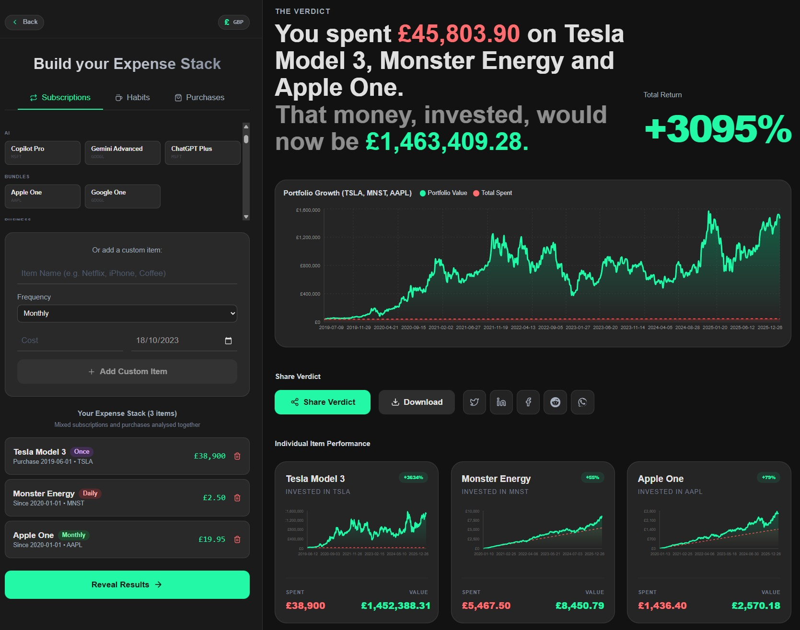

# Stocks Vs Subscriptions 📉 vs 📈

> *"See what your spending could have become."*

A cinematic, high-performance web application that visualizes the opportunity cost of recurring subscriptions (like Netflix, Spotify) or one-off luxury purchases (like a new iPhone) versus investing that money in the stock market.

🔗 **Live Demo**: [svs.imanhussain.com](https://svs.imanhussain.com/)



## ✨ Features

*   **Cinematic "Wizard" UI**: A 4-step immersive flow (Intro -> Choice -> Build -> Reveal).
*   **Automatic Product Detection**:
    *   **Subscriptions**: Type "Netflix" or "Spotify" → auto-resolves to NFLX/SPOT with typical monthly cost.
    *   **One-Off Products**: Type "iPhone" or "iPhone 15 Pro Max" → auto-detects AAPL ticker and £999 RRP.
    *   **Fuzzy Matching**: Handles variations ("PS5" → PlayStation 5, "MacBook Pro" → AAPL) with intelligent keyword matching.
*   **Real Financial Logic**:
    *   **Pre-IPO Handling**: Holds cash if the start date is before the stock's IPO.
    *   **Market Closures**: "Fill-forward" logic for weekends and holidays.
    *   **Adjusted Close**: Accounts for stock splits and dividends.
    *   **Multi-Stock Portfolio**: Compare multiple items against their respective company stocks simultaneously.
*   **Performance**:
    *   **Redis Caching**: Caches stock data for 30 days to minimise API usage.
    *   **Optimistic UI**: Debounced search and instant transitions using `framer-motion`.
    *   **Smooth Animations**: Animated growth percentage counter with easing functions.

## 🛠️ Tech Stack & Prerequisites

*   **Frontend**: `frontend/` (React, Vite, TypeScript, TailwindCSS v4, Zustand, Recharts, Framer Motion).
*   **Backend**: `backend/` (Hono, TypeScript, Yahoo Finance 2, Redis, ioredis).
*   **Database**: Redis (for caching, optional).
*   **Infra**: Docker, Coolify.
*   **Prerequisites**:
    *   Node.js 20+
    *   Docker (for production deployment)

## 🚀 Getting Started

### Local Development

1.  **Clone the repo**

    ```bash
    git clone https://github.com/iman-hussain/StocksVsSubscription.git
    cd StocksVsSubscription
    ```

2.  **Install Dependencies**

    ```bash
    npm install
    ```

3.  **Set up Environment Variables**

    Copy the example environment files and configure them:

    ```bash
    # Backend configuration
    cp backend/.env.example backend/.env

    # Frontend configuration
    cp frontend/.env.example frontend/.env
    ```

    **Backend (`backend/.env`):**

    *   `NODE_ENV`: Set to `development` for local, `production` for deployed environments
    *   `PORT`: Backend server port (default: 3000)
    *   `REDIS_URL`: Redis connection URL (optional, recommended for production)
    *   `CORS_ORIGIN`: Allowed frontend origins (comma-separated)

    **Frontend (`frontend/.env`):**

    *   `VITE_API_URL`: Backend API URL
        *   Local development: `http://localhost:3000`
        *   Production: `https://api.yourdomain.com`

4.  **Start Dev Server**

    ```bash
    npm run dev
    ```

    *   **Frontend**: [http://localhost:5173](http://localhost:5173) (fallback 5174, 5175)
    *   **Backend**: [http://localhost:3000](http://localhost:3000)

    *Note: Without a local Redis instance running, the server will silently fall back to in-memory caching.*

### Windows Quick Start

Simply double-click `start_local.bat` in the root directory. This will:

*   Check for Node.js and npm
*   Install dependencies
*   Launch both frontend and backend servers
*   Keep terminal open for logs

To stop, run `stop_local.bat` to kill servers on ports 3000/5173/5174.

### Production Deployment

Production deployment is handled via **Coolify**, which automatically builds the Dockerfiles in each service directory.

*   **Frontend**: [yourdomain.com](https://yourdomain.com)
*   **Backend API**: [api.yourdomain.com](https://api.yourdomain.com)

**Quick Reference - Environment Variables:**

| Service              | Variable       | Production Value                    |
| -------------------- | -------------- | ----------------------------------- |
| Backend              | `NODE_ENV`     | `production`                        |
| Backend              | `PORT`         | `3000`                              |
| Backend              | `REDIS_URL`    | `redis://your-redis:6379`           |
| Backend              | `CORS_ORIGIN`  | `https://yourdomain.com`            |
| Frontend (Build Arg) | `VITE_API_URL` | `https://api.yourdomain.com`        |

## 📂 Project Structure

```text
.
├── backend/                # Hono API Server
│   ├── data/               # Presets (Subscriptions, Products, Habits)
│   ├── lib/                # Shared utilities & caching logic
│   ├── index.ts            # Main entry point & API routes
│   └── Dockerfile          # Backend container definition
├── frontend/               # React (Vite) Frontend
│   ├── src/                # UI components & logic
│   ├── nginx.conf          # Production web server config
│   └── Dockerfile          # Frontend container definition
├── start_local.bat         # Windows dev launcher
├── stop_local.bat          # Windows process killer
├── package.json            # Monorepo scripts
└── README.md               # Documentation
```

## 🏗️ Architecture & Data Flow

The application uses a split stack architecture to ensure separation of concerns and independent scaling.

```text
+---------------------+       JSON / REST       +----------------------+
|                     | <---------------------> |                      |
|  Frontend (React)   |                         |   Backend (Node/Hono)|
|                     |                         |                      |
+----------+----------+                         +-----------+----------+
           ^                                                ^
           |                                                |
           | User Interaction                               | Read/Write
           |                                                |
           v                                                v
    (Browser / Client)                          +-----------+----------+
                                                |                      |
                                                |     Redis Cache      |
                                                |                      |
                                                +-----------+----------+
                                                            ^
                                                            |
                                                            | Cache Miss (Fetch)
                                                            |
                                                            v
                                                +-----------+----------+
                                                |                      |
                                                |   Yahoo Finance API  |
                                                |                      |
                                                +----------------------+
```

### Flow Description
1.  **Frontend**: The user interacts with the React UI. When they build a "stack" of subscriptions, the frontend sends a request to the backend with the product list and timeframes.
2.  **Backend**:
    *   **Check Cache**: The Hono server first checks **Redis** to see if historical stock data for the requested tickers (e.g., NFLX, AAPL) exists.
    *   **Fetch (if needed)**: If data is missing or stale (>30 days), it fetches fresh OHLCV data from **Yahoo Finance**.
    *   **Compute**: The server runs the "Time Travel" simulation, calculating exactly how many shares could have been bought on each specific billing date.
3.  **Response**: The processed comparison data (Subscription Cost vs Portfolio Value) is sent back to the frontend for visualization.
